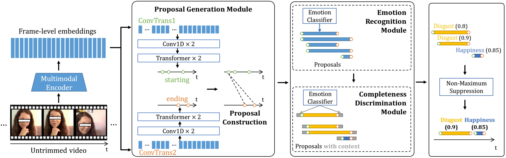

# AVES: An Audio-Visual Emotion Stream Dataset for Temporal Emotion Detection

Yan Li, Wei Gan, Ke Lu, Dongmei Jiang, Ramesh Jain

Accepted by IEEE Transactions on Affective Computing, DOI: [10.1109/TAFFC.2024.3440924](https://doi.org/10.1109/TAFFC.2024.3440924).

    <a href="AVES.pdf" class="button" style="background-color: #4CAF50; color: white; padding: 10px 20px; text-align: center; text-decoration: none; display: inline-block; font-size: 16px; margin: 4px 2px; cursor: pointer; border-radius: 5px;">Download Paper</a>
    <a href="" class="button" style="background-color: #008CBA; color: white; padding: 10px 20px; text-align: center; text-decoration: none; display: inline-block; font-size: 16px; margin: 4px 2px; cursor: pointer; border-radius: 5px;">Download Dataset</a>
    <a href="" class="button" style="background-color: #f44336; color: white; padding: 10px 20px; text-align: center; text-decoration: none; display: inline-block; font-size: 16px; margin: 4px 2px; cursor: pointer; border-radius: 5px;">Download License</a>

## Abstract

Human emotions vary over time, which can be vividly described as a stream of emotions. Observing the emotion stream in daily life provides valuable insights into an individual's mental state. However, existing research in emotion understanding has mainly focused on classification tasks, assigning an emotion category to a well-trimmed segment or each frame within a continuous signal. In contrast, the task of temporal emotion detection, which involves **locating** the boundaries of emotion segments and **recognizing** their categories in untrimmed signals, has not been fully explored. To advance research in this area, this paper introduces an in-the-wild Audio-Visual Emotion Stream (AVES) dataset, which is reliably annotated with the time boundaries and emotion category for each emotion segment in the videos. Thus, AVES can serve as a solid benchmark for temporal emotion detection tasks. Moreover, considering the flexible boundaries and varying durations of emotion segments, we propose a Boundary Combination Network (BoCoNet) for temporal emotion detection, which leverages short-term temporal context information to first predict the boundaries of emotion segments and then locate the entire emotion segments. Extensive experiments conducted on various representative unimodal and multimodal representations demonstrate that BoCoNet achieves state-of-the-art results. The AVES dataset will be released to the research community. We expect that this paper can advance the research on emotion stream and temporal emotion detection.

## Dataset Highlights

Compared with existing emotion datasets, the highlights of AVES can be summarized as follows:

*   **Novelty.** Most existing emotion datasets are designed for utterance-level emotion recognition or frame-level facial expression recognition. In contrast, the AVES dataset annotates the untrimmed continuous multimodal signals with the emotion segments, which provides a benchmark for temporal emotion detection research.
*   **Reliability.** Each video in AVES is labeled by seven annotators with research backgrounds in affective computing, and the videos with low annotation consistency are removed from AVES. This ensures that AVES can serve as a solid testbed for temporal emotion detection tasks.
*   **Challenge.** Temporal emotion detection tasks are inherently challenging as they require not only recognizing the emotion categories but also localizing the boundaries of emotion segments. Moreover, the videos in the AVES dataset are in the wild, featuring complex environments and scenes, making the temporal task even more challenging.

## Boundary Combination Network

## Changelog

* 2024-12-11: Website created.
